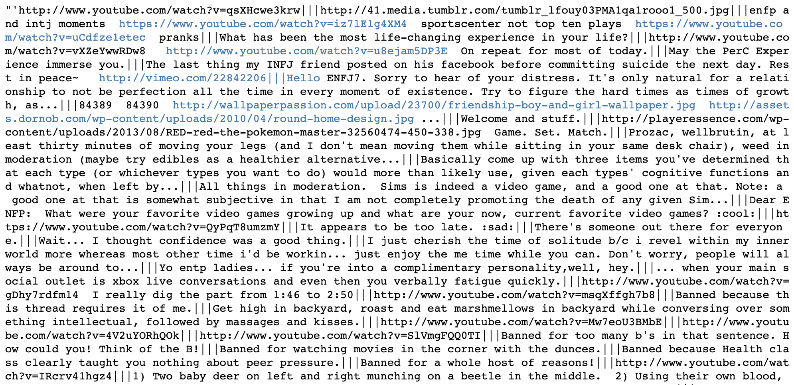
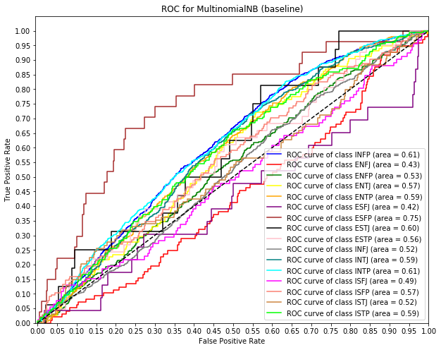

# myers-briggs-project
***
## Motivation

The Myers–Briggs Type Indicator (MBTI) is one of the most popular questionnaires used to categorize individuals' personality types measuring where an individual lands on the spectrum of energy, decisions, information and lifestyle preferences.  Many universities and businesses have used the MBTI test to help individuals gain a deeper understanding of their strengths and weaknesses to figure out which career paths would be best suited for their personality type and/or learn to understand perspective of others to improve collaboration. This is of course not a hard science, but rather interesting lens for self-reflection.   


[INSERT BUSINESS USE CASE / GOAL OF THE PROJECT]


***
## Data Source

We used a dataset from Kaggle that was scraped from [PersonalityCafe Forum](https://www.personalitycafe.com/forum/) and contained the following:

- 8,675 users with self-labeled MBTI types
- 50 comments per user


***
## Data Exploration & Feature Engineering

__Text Data__

The Kaggle dataset did not contain any missing values but we did have to process the raw text data. Below is a snapshot of what the raw text data looks like.



The first thing we did was remove all hyperlinks - we didn't think they provided any value for purposes of our classification. Next, we thought it would be interesting to engineer some additional features based on the text as listed below. Once we captured the metadata, we removed digits, emojis and lower-cased all words before lemmatizing, tokenizing and removing stopwords.

- Count of uppercase letters used
- Count of emojis used
- Count of exclamation marks used
- Count of digits used

__Distribution of Classes__

We plotted the count of unique classes (the 16 MBTI types) to see whether the distribution matched that of the naturally occurring MBTI personality types (INSERT LINK TO STAT RESOURCE HERE).

According to our graph, the sample did not match the general population distribution was it is very balanced so we knew we had to account for class imbalance in our modeling step.


__Tokenized Words__

The final tokenized list consisted of 112,320 words, with the following top 25 most commons words - all of these words seemed to make sense.

```
[('like', 71077),
 ('think', 50948),
 ('people', 48145),
 ('one', 40171),
 ('know', 38284),
 ('really', 35257),
 ('would', 34996),
 ('thing', 34553),
 ('time', 33622),
 ('get', 33333),
 ('feel', 25712),
 ('type', 24019),
 ('make', 23643),
 ('much', 23067),
 ('say', 22693),
 ('well', 22591),
 ('friend', 22132),
 ('way', 21759),
 ('love', 21739),
 ('want', 21194),
 ('good', 20722),
 ('see', 19532),
 ('something', 19486),
 ('also', 18286),
 ('lot', 18181),
 ...]
```
We worked with two datasets for our models, matrix of vectorized words only and a matrix of vectorized words and metadata, to see if

 ***
## Modeling


__Baseline Model: Multinomial Naive Bayes__

Our baseline model was a multinomial Naive Bayes model with default parameters. The test performance was not very good (21% for micro avg. F1-score) but was still better than random guessing (6.25%).

```
                precision    recall  f1-score   support

        INFP       0.00      0.00      0.00        38
        ENFJ       0.00      0.00      0.00       135
        ENFP       0.00      0.00      0.00        46
        ENTJ       0.00      0.00      0.00       137
        ENTP       0.00      0.00      0.00         8
        ESFJ       0.00      0.00      0.00        10
        ESFP       0.00      0.00      0.00         8
        ESTJ       0.00      0.00      0.00        18
        ESTP       0.50      0.00      0.01       294
        INFJ       0.21      1.00      0.35       367
        INTJ       0.00      0.00      0.00       218
        INTP       0.00      0.00      0.00       261
        ISFJ       0.00      0.00      0.00        33
        ISFP       0.00      0.00      0.00        54
        ISTJ       0.00      0.00      0.00        41
        ISTP       0.00      0.00      0.00        67

   micro avg       0.21      0.21      0.21      1735
   macro avg       0.04      0.06      0.02      1735
weighted avg       0.13      0.21      0.07      1735
```





__Intermediary Models: Random Forest, Xgboost, Stochastic Gradient Descent__

We ran a number of other models as well:

- Random Forest
We first tried a random forest model at different test sizes. Our results showed that the test size of 0.333 resulted in the highest test accuracy score so we'll set the train-test-split for random forests at this split.


We then ran a GridSearch to find the best parameters for our random forest. The GridSearch results recommended the following parameters.

```
{'criterion': 'gini',
 'max_depth': None,
 'min_samples_split': 10,
 'n_estimators': 100}
```

Below are the classification report, confusion matrix and ROC-AUC graph for the random forest model at its 'best'.

```
Classification Report:

                precision    recall  f1-score   support

        INFP       0.00      0.00      0.00        63
        ENFJ       0.85      0.05      0.09       225
        ENFP       0.00      0.00      0.00        77
        ENTJ       0.73      0.11      0.18       228
        ENTP       0.00      0.00      0.00        14
        ESFJ       0.00      0.00      0.00        16
        ESFP       0.00      0.00      0.00        13
        ESTJ       0.00      0.00      0.00        30
        ESTP       0.46      0.50      0.48       490
        INFJ       0.34      0.91      0.49       610
        INTJ       0.65      0.33      0.44       364
        INTP       0.46      0.50      0.48       434
        ISFJ       0.00      0.00      0.00        55
        ISFP       0.00      0.00      0.00        90
        ISTJ       0.00      0.00      0.00        68
        ISTP       1.00      0.01      0.02       112

   micro avg       0.41      0.41      0.41      2889
   macro avg       0.28      0.15      0.14      2889
weighted avg       0.46      0.41      0.33      2889
```


We also ran the above models using a mixed matrix of vectorized text and the metadata we engineering, but those models did not perform as well so we decided not to use the mixed-matrix.


__Final Model: Support Vector Classifier__

After trying all four kernels (poly, RBF, linear, and sigmoid) the linear kernel performed the best out of all the models so that became our final model.

The micro avg.

```
                precision    recall  f1-score   support

        INFP       0.65      0.24      0.35        55
        ENFJ       0.70      0.58      0.63       215
        ENFP       0.72      0.36      0.48        91
        ENTJ       0.63      0.62      0.62       206
        ENTP       0.60      0.19      0.29        16
        ESFJ       0.00      0.00      0.00        16
        ESFP       0.00      0.00      0.00        15
        ESTJ       0.88      0.25      0.39        28
        ESTP       0.66      0.71      0.68       483
        INFJ       0.63      0.82      0.71       617
        INTJ       0.66      0.70      0.68       373
        INTP       0.64      0.77      0.70       433
        ISFJ       0.92      0.46      0.61        50
        ISFP       0.72      0.31      0.43       100
        ISTJ       0.80      0.36      0.50        66
        ISTP       0.84      0.54      0.65       125

   micro avg       0.66      0.66      0.66      2889
   macro avg       0.63      0.43      0.48      2889
weighted avg       0.66      0.66      0.64      2889
```


***
## MBTI Predictor

Using our final model, we created a function that will predict an MBTI given a string of text that is passed in. Try it for yourself in the mbti.ipynb and see what you get!
